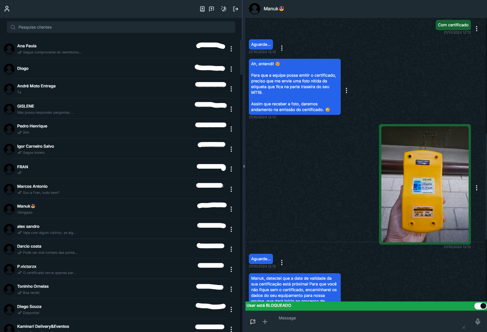

# WhatsApp Web Clone com Integração IA (Gemini)
 
Este é um projeto que simula o WhatsApp Web, desenvolvido em Next.js, com funcionalidades avançadas para comunicação com clientes via WhatsApp e integração com IA (Gemini). O sistema foi projetado para ser utilizado por empresas, permitindo um controle eficiente sobre mensagens automatizadas e interações manuais com clientes.

## Objetivo do Projeto

O principal objetivo deste projeto é fornecer uma plataforma de comunicação eficiente, similar ao WhatsApp Web, mas com funcionalidades adicionais, como:

- Integração com a IA Gemini para responder automaticamente aos clientes com informações da empresa, incluindo respostas a mensagens de texto, áudios, imagens e vídeos.
- Controle manual sobre as respostas da IA, permitindo que o usuário decida se a IA deve ou não responder a um cliente específico. Esta funcionalidade é especialmente importante, pois permite que os funcionários tomem a frente em conversas que precisam de uma atenção humana, bloqueando temporariamente as respostas automáticas da IA.
- Bloqueio Automático para Perguntas Fora de Escopo: A IA é treinada para identificar e bloquear automaticamente perguntas que não estejam relacionadas à empresa, garantindo que o sistema se concentre em fornecer informações relevantes.
- Solicitação de Suporte Humano: A IA detecta automaticamente quando um cliente deseja falar com um atendente humano. Essa funcionalidade notifica a equipe e impede que a IA continue respondendo, garantindo uma transição suave para o atendimento personalizado.

## Estrutura do Projeto

O projeto está dividido em duas partes principais:

1. **Frontend**: Aplicativo desenvolvido em Next.js que simula a interface do WhatsApp Web. Inclui integração com Firestore para atualização em tempo real das mensagens e a capacidade de bloquear a IA para clientes específicos.

   - [Leia mais sobre o Frontend](./Front_end/README.md)

2. **Backend**: Servidor serverless implementado com Google Cloud Functions, que recebe as mensagens dos clientes e as salva no Firestore, além de lidar com integrações com a IA Gemini para respostas automáticas.

   - [Leia mais sobre o Backend](./Back_end/README.md)

## Funcionalidades

- **Bloqueio Automático de Clientes**: Caso um cliente faça perguntas não relacionadas à empresa, ele receberá até três advertências. Após isso, o cliente é bloqueado automaticamente e só pode ser desbloqueado por um funcionário. Além disso, se o cliente solicitar conversar com um atendente humano, ele também é automaticamente bloqueado e um funcionário é notificado por e-mail para atender o cliente.

- **Integração em Tempo Real**: Utiliza `onSnapshot` do Firestore para sincronizar mensagens em tempo real entre os clientes e o Front_end.
- **Controle de Respostas da IA**: Possibilidade de desativar a resposta automática da IA para determinados números de telefone, permitindo controle manual das interações com os clientes.
- **Respostas Automáticas Inteligentes**: Utiliza a IA Gemini para responder automaticamente com informações predefinidas sobre a empresa, incluindo respostas a mensagens de texto, áudios, imagens e vídeos.
- **Armazenamento de Mídia**: Utiliza Google Cloud Storage para armazenar áudios, imagens, vídeos e arquivos como PDF e DOC.
- **Processamento de Mensagens com Cloud Tasks**: Utiliza Google Cloud Tasks para garantir que as mensagens de um mesmo número de celular sejam processadas sequencialmente, enquanto mensagens de diferentes números podem ser processadas simultaneamente.

## Capturas de Tela




## Como Utilizar

Cada parte do projeto está em seu próprio repositório:

- [Frontend](./Front_end) - Contém a interface do WhatsApp Web Clone.
- [Backend](./Back_end) - Contém as funções serverless para integração com o WhatsApp e a IA Gemini.

Leia os arquivos README em cada diretório para instruções de instalação e uso.

## Tecnologias Utilizadas

- **Next.js** para desenvolvimento da interface de usuário.
- **Node.js** para desenvolvimento do Back_end serverless.
- **Google Cloud Functions** para Back_end serverless.
- **Google Firestore** para armazenamento e sincronização das mensagens.
- **Google Cloud Storage** para armazenamento de áudios, imagens, vídeos e outros arquivos.
- **IA Gemini** para respostas automáticas e inteligentes.


## Estrutura do Projeto

## Interface do Projeto (Firestore)

No Firestore, o projeto contém duas coleções principais: `history_w_ia` e `w_s_ia`. Cada uma tem um papel importante tanto para o backend quanto para o frontend. Abaixo, seguem as interfaces utilizadas e suas descrições:

### Coleção `history_w_ia`

Esta coleção armazena os números de cada cliente e suas respectivas mensagens, incluindo nomes e outros detalhes. A estrutura das interfaces é a seguinte:

```typescript
interface historys {
    parts: [{ text: string }];
    role: 'user' | 'model';
}

export interface whatsapp_message {
    messageType: string;
    content: string;
    sender: 'user' | 'model' | 'admin';
    date: number; // Alterado para 'number' para armazenar o timestamp
    view: boolean;
    id?: string;
    index_context?: number;
}

export interface history_cliente {
    avisos: number;
    bloqueio_ia: boolean;
    bloqueio_user: boolean;
    history: historys[];
    history_bloqueio: historys[];
    name: string;
    phone: string;
    whatsapp_messages: whatsapp_message[];
    user_avatar: string;
}

export interface Conversation {
    id: string;
    history_cliente: history_cliente;
    waid_view?: {
        waid: string[];
        timestamp: string;
    };
    user_block_message?: boolean;
}
```

- **`history_cliente`**: Contém os dados do cliente, incluindo as conversas (`history`), o histórico de bloqueio (`history_bloqueio`), avisos e status de bloqueio. Além disso, armazena o avatar do usuário e as mensagens do WhatsApp.
- **`whatsapp_messages`**: Armazena as mensagens e seus detalhes, incluindo o tipo de mensagem (texto, áudio, imagem, etc.), conteúdo, remetente, data, visualização e outras informações relevantes.
- **`waid_view`**: Utilizado para verificar a última mensagem visualizada pelo cliente, permitindo que o frontend exiba se a mensagem foi vista.
- **`user_block_message`**: Indica se um cliente está bloqueado devido a comportamento inadequado, como envio de spam, e não permite o recebimento de novas mensagens caso seja `true`.

### Coleção `w_s_ia`

Esta coleção ela não é exencial para o projeto podendo ser deletada mas lembre-se de mudar isso no codigo tanto no backend quanto no frontend. Ela contém documentos para configuração de prompts e treinamento da IA. Dentro dela, há um documento chamado `prompts`, com a seguinte interface:

```typescript
{
    bloqueio_perg: [{ text: 'input: string' }, { text: 'output: string' }...], // Obrigatório incluir input e output para o treinamento da IA no modo generateContent Gemini (opcional)
    bloqueio_support: [{ text: 'input: string' }, { text: 'output: string' }...], // Exemplos para treinamento da IA no modo generateContent Gemini (opcional)
    ia: string; // Exemplo: "models/gemini-1.5-pro" (opcional)
    prompt_doc: [{ title: string, content: string }...]; // Formato padrão para passar ao systemInstruction do Gemini (opcional)
    prompt_perg: [{ title: string, content: string }...] // Exemplos de perguntas e respostas de como a IA deve responder (opcional)
}
```

- **`bloqueio_perg`**: Contém exemplos de entradas e saídas (`input` e `output`) para treinar a IA `generateContent` do Gemini. Utilizado para definir padrões de resposta em situações específicas.
- **`bloqueio_support`**: Utilizado para verificar quando o cliente deseja suporte técnico e configurar respostas automáticas adequadas.
- **`ia`**: Define qual modelo da IA será utilizado, como por exemplo "models/gemini-1.5-pro".
- **`prompt_doc`**: Contém documentos que serão passados como `systemInstruction` para a IA Gemini.
- **`prompt_perg`**: Exemplos opcionais de perguntas e respostas, utilizados para guiar o comportamento da IA.

## Contribuição

Contribuições são bem-vindas! Sinta-se à vontade para abrir issues e pull requests para melhorar o projeto.

---

Este README é um resumo geral do projeto. Você pode explorar mais detalhes acessando as documentações separadas do [Frontend](./Front_end/README.md) e do [Backend](./Back_end/README.md).
